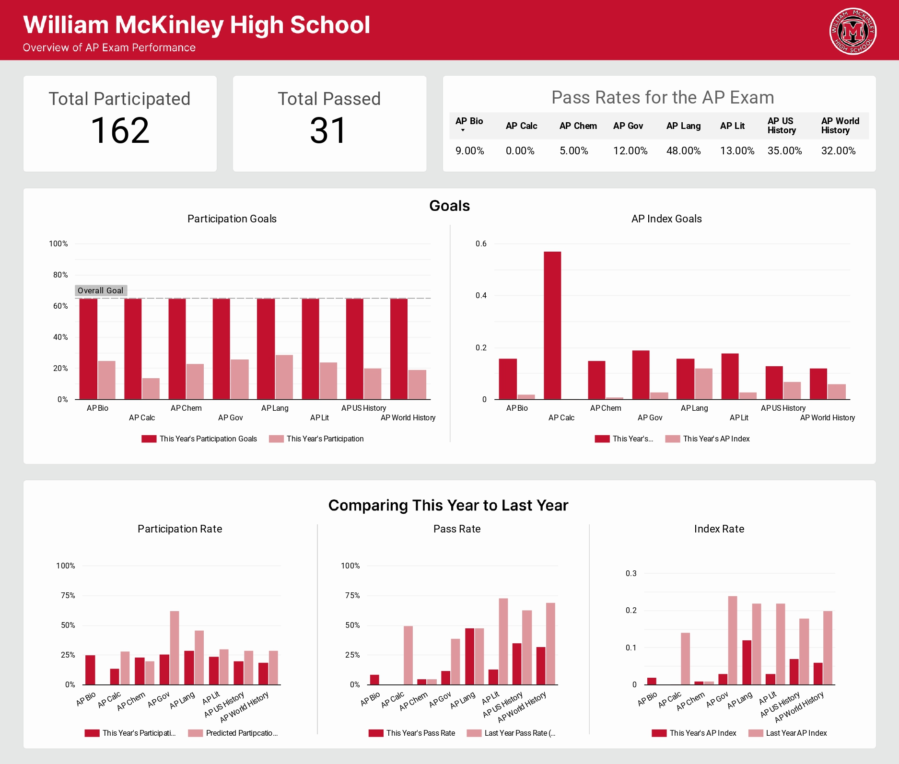

# 🏫 AP Exam Score

## 🎯 Goal
At the school students in the 10th, 11th and 12th grade enroll in AP courses. Students take various assessments throughout the year that are aligned to the courses’  AP exam. The scores on assessments lead to a “Predicted Score.” Predicted Scores are then used to support students in deciding whether or not they should take the official AP exam at the end of the school year. 

## ❓ Questions
Below are a few questions asked to answer for this dataset. 
- What number of students are passing against the number tested? What are the highest/lowest pass rates? 
- How did the pass rates this year compare to pass rates from last year? 
- Compare this year’s participation goals against this year’s actual participation rates. 
- How did the school perform on this year’s index goals against this year’s actual index rates? 

## Additonal Details
- A passing AP score is a score of AP3 or higher
- **The AP Index** = (the participation rate) * (pass rate)
- **Participation Rate** = (number of students who tested in a given AP course)/(total number of students in the grade level)
- **Pass rate** = (number of students who passed the test in a given AP content)/(total number of students who tested) 

**Note:** The above information is all dummy data and does not actually represent real students. 

## Report
View the interactive report using Google Looker Studio [here](https://lookerstudio.google.com/reporting/1e843dde-4fd3-4040-83e6-598f37685466).

## 📁 Files
- [query.sql](https://github.com/kellyjadams/ap-exam-scores/blob/main/query.sql) is the SQL code I used to analyze the data.
- [AP_Exam_Performance_Dashboard.jpg](https://github.com/kellyjadams/ap-exam-scores/blob/main/AP_Exam_Performance_Dashboard.jpg) is an image of the final dashboard I created. 

## 📊 Data
Below I go into how the data is laid out. 

### The Tables 
There are a total of 10 tables:
1. AP Lang
2. AP World
3. GP Gov
4. AP US History
5. AP Bio
6. AP Chem
7. AP Literature
8. AP Calculus
9. Last Years Data - For Comps
10. This Years Goals

#### AP Scores Table
Below is an example of the AP Language table. All of the courses have the same format except the subject name is different. 

| Student Identifier | Grade | Cohort     | AP Lang Predicted AP Score           | AP Lang Predicted AP Level | Did Student Test? | AP Lang Actual AP Score | AP Lang - Actual AP Level |
|--------------------|-------|------------|--------------------------------------|----------------------------|-------------------|-------------------------|---------------------------|
| Student 1          | 11    | Georgetown | Not Projected AP3+ (Off Track = AP1) | Below AP3                  | Yes               | 2                       | Below AP3                 |
| Student 2          | 11    | Notre Dame | Not Projected AP3+ (Off Track = AP1) | Below AP3                  | Yes               | 2                       | Below AP3                 |
| Student 3          | 11    | Georgetown | On Track to AP3                      | AP3 or Above               | No                | No Score                | No Score                  |
| Student 4          | 11    | Notre Dame | Not Projected AP3+ (Off Track = AP1) | Below AP3                  | Yes               | 3                       | AP3 or Above              |
| Student 5          | 11    | Notre Dame | On Track to AP4+                     | AP3 or Above               | No                | No Score                | No Score                  |

Here is a data dictionary of the values:
- **Student Identifier:** The student ID
- **Grade:** The grade level of the student, for this dataset the grades are 10-12.
- **Cohort:** Which college the student would like to go to
- **AP (Subject) Predicted Score:** The predicted score based off of previous AP assessments. An AP score can be between 1-5.
- **AP (Subject) Predicted AP Level:** The predicted level based off of previous AP assessments. A student passes if they get a score of 3 or above, a fail if they get a 2 or below. 
- **Did Student Test?:** Yes or No
- **AP (Subject) Actual AP Score:** The actual score the student recieved if they took the AP exam, the score can be between 1-5. If they did not then it's a "No Score".
- **AP (Subject) - Actual AP Level:** The actual level of the student based off of the score they recieved during the AP Exam. If a student gets a score of 3 or above, it reads "AP3 or Above", if it's a score of 2 or below then it's "Below AP3", and if a student did not test then it is "No Score". 

Example of a table is: 

#### Last Years Scores Table

| Courses          | Last Year Pass Rate     | Last Year AP Index      | Predicted Participation Rates from Prior Year |
|------------------|-------------------------|-------------------------|-----------------------------------------------|
| AP Bio           | NA - Did Not Administer | NA - Did Not Administer | NA - Did Not Administer                       |
| AP Calc          | 0.5                     | 0.14                    | 0.28                                          |
| AP Chem          | 0.05                    | 0.01                    | 0.20                                          |
| AP Lang          | 0.48                    | 0.22                    | 0.46                                          |
| AP Lit           | 0.73                    | 0.22                    | 0.30                                          |
| AP Gov           | 0.39                    | 0.24                    | 0.62                                          |
| AP US History    | 0.63                    | 0.18                    | 0.29                                          |
| AP World History | 0.69                    | 0.2                     | 0.29                                          |

#### This Years Scores Table

| Courses          | Last Year Pass Rate     | Last Year AP Index      | Predicted Participation Rates from Prior Year |
|------------------|-------------------------|-------------------------|-----------------------------------------------|
| AP Bio           | NA - Did Not Administer | NA - Did Not Administer | NA - Did Not Administer                       |
| AP Calc          | 0.5                     | 0.14                    | 0.28                                          |
| AP Chem          | 0.05                    | 0.01                    | 0.20                                          |
| AP Lang          | 0.48                    | 0.22                    | 0.46                                          |
| AP Lit           | 0.73                    | 0.22                    | 0.30                                          |
| AP Gov           | 0.39                    | 0.24                    | 0.62                                          |
| AP US History    | 0.63                    | 0.18                    | 0.29                                          |
| AP World History | 0.69                    | 0.2                     | 0.29                                          |
